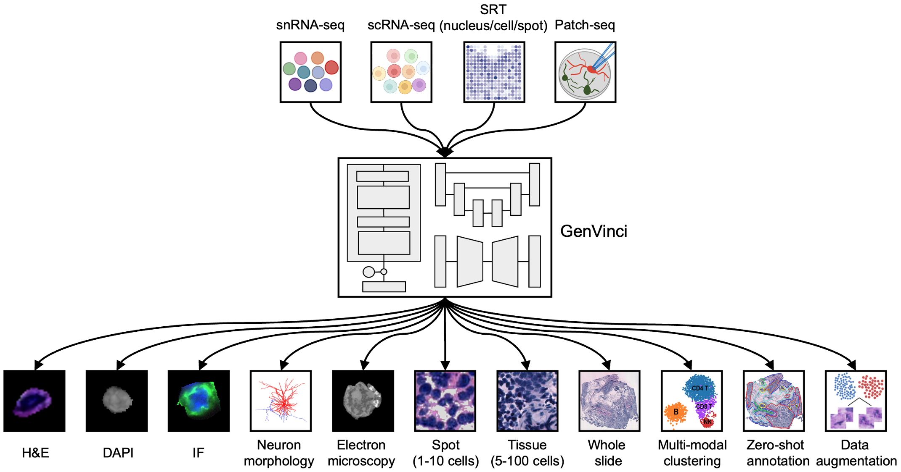

# GenVinci
<p align="center">

</p>


**GenVinci** is a generative model that learns a multi-modal representation of morphological and molecular profiles and generate cellular and tissue images from single-cell expression profiles. 

## Datasets
We analyzed several spatial transcriptomics datasets across different sequencing resolutions and technologies (Spatial Transcriptomics, 10x Genomics Visium, HTAPP MERFISH and scRNA-seq, Nanostring CosMx SMI, Patch-seq, and STcEM MERFISH). The download links can be found in the manuscript.

## Installation and Usage

Please install and utilize conda (https://docs.anaconda.com/miniconda/) to create and activate a environment.
```bash
$ git clone https://github.com/jian-shu-lab/GenVinci.git
$ cd GenVinci
$ conda env create -f env.yaml
$ conda activate genvinci
```

## Continued pre-training
The continued pre-training step is based on Geneformer (https://huggingface.co/ctheodoris/Geneformer) and we used it to further pre-train our own spatial transcriptomics datasets. Before running the following scripts, please download and move the Geneformer folder (https://huggingface.co/ctheodoris/Geneformer/tree/main/geneformer) into the 'src/pretrain' folder and preprocess your dataset as Geneformer requested (https://huggingface.co/ctheodoris/Geneformer/tree/main/examples).

```bash
# please specify your dataset at the end of the command, here we use 'he_st' dataset as an example
deepspeed ./src/pretrain/pretrain_geneformer_w_deepspeed.py --deepspeed ds_config.json he_st
```

## Fine tuning using Stable Diffusion
We fine-tuned a Stable Diffusion model (https://github.com/CompVis/stable-diffusion) to generate cellular and tissue images from single-cell expression profiles. We use standard SD1.5 which can be downloaded from the [official page of Stability](https://huggingface.co/runwayml/stable-diffusion-v1-5/tree/main). The file ['v1-5-pruned.ckpt'](https://huggingface.co/runwayml/stable-diffusion-v1-5/tree/main) is needed.
```bash
python3 ./src/finetune/rna_ldm.py --dataset he_st --pretrain_mlm_path 240104_230849 --img_size 256
```

## Generation of cellular images from gene expression with trained checkpoints
The well-trained GenVinci can be used to generate cellular images from gene expression profiles.
```bash
python3 ./src/finetune/gen_from_rna.py --dataset he_st --checkpoint checkpoint_100.pth --generate --test --num_samples 5 --batch_size 4
```

## Checkpoint and demo dataset
We tested a checkpoint trained on one of Spatial Transcriptomics datasets and H&E images. The generated images are shown below (the first column is the ground truth and we randomly generate 5 times from the same gene expression profile). The pretrained model checkpoints and datasets will be coming soon.
<p align="center">

</p>

## Acknowledgement

This code is built upon the publicly available code [Geneformer](https://huggingface.co/ctheodoris/Geneformer), [Mind-vis](https://github.com/zjc062/mind-vis) and [StableDiffusion](https://github.com/CompVis/stable-diffusion). Thanks these authors for making their excellent work and codes publicly available.


## Manuscript
Please refer to our manuscript Xingjian et al. (2024) for more details.


Contact
-----------------------
We are happy about any feedback! If you have any questions, please feel free to contact Xingjian Chen (xchen57@mgh.harvard.edu). Find more research in SHU LAB (https://www.jianshulab.org/).

