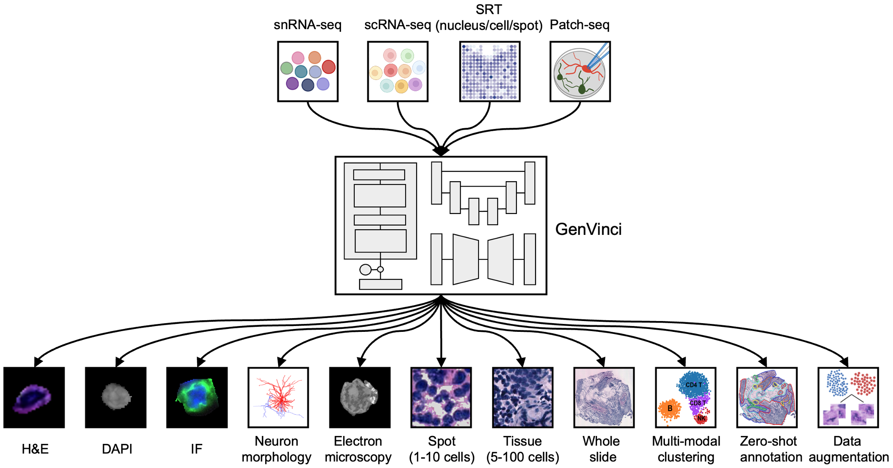

# Generation of cellular and tissue images from single-cell expression profiles with GenVinci

## GenVinci
**GenVinci** is a generative model that learns a multi-modal representation of morphological and molecular profiles and uses it for gene-to-image translation across various profiling platforms and imaging techniques. GenVinci’s cascaded architecture allows us to flexibly apply it across a range of downstream tasks, including image generation, multi-modal clustering, zero-shot classification, and data augmentation. This document introduces the procedures required for replicating the results in *Generation of cellular and tissue images from single-cell expression profiles with GenVinci*.

## Abstract
Cells were discovered and originally characterized through imaging hundreds of years ago, whereas recent advances in single-cell genomics are enabling their comprehensive cataloging by comprehensive molecular profiles. However, most technologies characterize cells by one modality at a time, requiring substantial measurement effort to collect multiple views and leading to multiple, seemingly disparate views of their identity. This is largely because the mapping between views is non-linear and not well-understood. Moreover, while imaging data at the cell and tissue level has longstanding interpretation in clinical practice through histopathology, molecular profiles are more recent, mostly destructive, and much more costly. Recent advances in generative AI and deep learning have opened the way to generate multiple views through non-linear transformation and may offer a way to unify different aspects of cells and tissues. Here, we introduce GenVinci, a generative model based on transformer and diffusion models that learns a multi-modal representation of cells and tissues and reconstructs morphological information from transcriptome profiles to generate cellular and tissue images from single-cell expression profiles during inference. We demonstrate how GenVinci can generate diverse types of imaging data, including histological (hematoxylin and eosin (H&E)) stains, fluorescence microscopy images, neuron morphology, and electron microscopy, from various molecular profiles at different resolutions. GenVinci generates accurate cellular and tissue images compared to ground-truth morphologies, cell types, and pathological annotations. It outperforms a convolutional neural network (CNN) baseline in both generation quality and semantic mapping. Thanks to its cascaded architecture, GenVinci can be flexibly applied to a range of downstream tasks, including image generation, multi-modal clustering, zero-shot classification, and data augmentation. GenVinci can unify different views of cell and tissue biology, while greatly reducing the need for multiple measurements, towards an ultimate goal of virtual cell and tissue simulators.

## Overview
Briefly, we train the GenVinci model in two stages: an initial general-purpose continued pretraining on expression data, followed by fine-tuning with paired imaging data for the gene-to-image translation task. In the pretraining step, we leverage the single-cell large language model Geneformer to encode high-dimensional expression data into robust latent embeddings. To obtain better cell embeddings specific to the utilized profiling techniques, we further pre-trained Geneformer on additional relevant gene expression data, using the original masked language modeling strategy, where the expression of some genes is randomly masked in a cell and then predicted. In the fine-tuning stage, we cascade the continued pre-trained Geneformer with Stable Diffusion, a diffusion model where the extracted gene expression embeddings serve as transcriptomic prompts to generate cell images. Since the SD model is specifically designed for text-to-image generation and was trained on billions of image-text pairs, it may not generalize well with limited gene expression-image pairs. We thus employed another biomedical vision-language model, BiomedCLIP, to provide weak supervision to reduce modality discrepancies for better aligning the transcriptomic prompts with image and text embeddings.

During the inference stage, GenVinci generates multiple cell images from one expression profile or signature, reflecting different perspectives of the cell morphology. It then ranks the generated images that are closest to the ground truth based on similarity scores between the input expression profile and the generated images. This flexible, rank-based approach to inference can be highly effective in real-world clinical settings when pathologists or physicians want to avoid incorrect predictions and choose the most confident generation.  
 
## Datasets
We analyzed several publicly available spatial transcriptomics and sc/snRNA-seq datasets. The Spatial Transcriptomics dataset can be downloaded from https://data.mendeley.com/datasets/29ntw7sh4r/5. The 10x Genomics Visium dataset can be found at https://www.10xgenomics.com/resources/datasets/human-breast-cancer-block-a-section-1-1-standard-1-1-0 and https://www.10xgenomics.com/resources/datasets/human-breast-cancer-block-a-section-2-1-standard-1-1-0. The HTAPP MERFISH and paired scRNA-seq datasets can be found as part of the HTAN-HTAPP data release on Synapse (syn20834712). The Nanostring CosMx SMI dataset can be found at https://nanostring.com/products/cosmx-spatial-molecular-imager/ffpe-dataset/nsclc-ffpe-dataset/. Patch-seq datasets were downloaded from Brain Image Library https://download.brainimagelibrary.org/3a/88/3a88a7687ab66069/ and The DANDI Archive https://dandiarchive.org/dandiset/000020/. The STcEM MERFISH dataset can be downloaded from the Gene Expression Omnibus (GEO) database under accession number GSE202638.

An example dataset shown in data/exps are used for demonstration.

## Continued pre-training
The continued pre-training step is based on Geneformer and we used it to further pre-train our own spatial transcriptomics datasets.

## Fine tuning using Stable Diffusion
We fine-tuned a Stable Diffusion model for gene expression-to-image generation.

## Manuscript
Please refer to our manuscript Xingjian et al. (2024) for more details.

Contact
-----------------------
We are happy about any feedback! If you have any questions, please feel free to contact Xingjian Chen (xchen57@mgh.harvard.edu).
Find more research in SHU LAB (https://www.jianshulab.org/).

